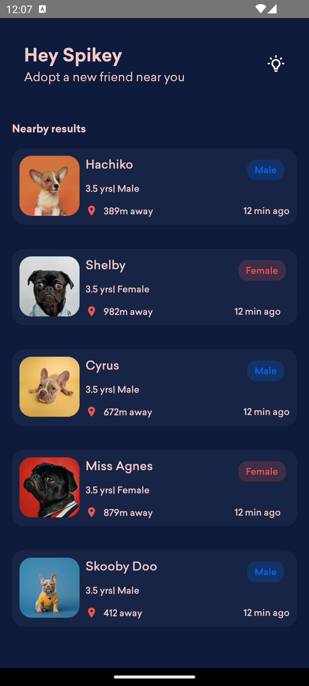
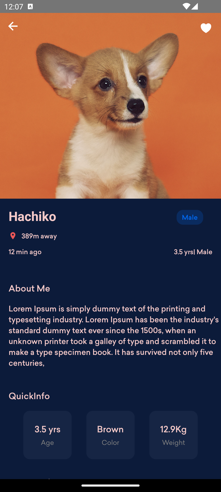

# Wiggles - My React Native UI Exploration

Welcome to Wiggles, my personal React Native project created to dive into the world of mobile app UI development using React Native. This project serves as my sandbox to experiment with different React Native UI components, navigation patterns, and styling techniques.

## Purpose

Wiggles is a learning playground where I can explore, tinker, and gain hands-on experience in crafting beautiful and responsive user interfaces for mobile applications. It's a journey to enhance my skills in React Native development and create visually appealing apps.

## Screenshots


*Caption for Screenshot 1*


*Caption for Screenshot 2*

...

## APK Download

You can download the latest APK for Wiggles from the following link:
[Download Wiggles APK](#)

## How to Run

To run the project on your local machine, follow these simple steps:

1. Clone the repository:
   ```bash
   git clone https://github.com/your-username/wiggles.git
   cd wiggles

2. Install dependencies
   ``` bash
   npm install
   ```

3. Run the project
   ```bash
   npx react-native run-android  # For Android
   npx react-native run-ios      # For iOS
   ```

## Credits
I drew inspiration for Wiggles from my own desire to learn and experiement with React Native.
Special thanks original author for this design.

Feel free to explore, learn, and contribute to Wiggles. If you have any suggestions or find issues, please don't hesitate to create a pull request or submit an issue on the [GitHub repository](https://github.com/Spikeysanju/Wiggles) which is written in Jetpack Compose.

Happy coding and exploring! 🚀

